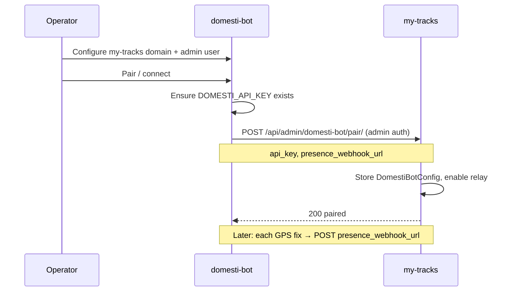

# Plan: domesti-bot location relay (my-tracks companion)

This document is the **my-tracks** side of integrating with [domesti-bot](../domesti-bot/docs/RULE_ENGINE_PLAN.md). domesti-bot owns home automation rules, geofence evaluation, sunset checks, and device actions. my-tracks remains the **location ingest and map** service and relays GPS fixes to domesti-bot when paired.

**Status:** planning only — no relay or admin UI implemented in this document.

---

## Responsibilities split

| Concern | Owner | Mechanism |
| --- | --- | --- |
| OwnTracks ingest, map, friends | my-tracks | Existing MQTT/HTTP → SQLite |
| Participant roster | my-tracks (source of truth) | **Manual pull** by domesti-bot (`POST /v1/rules/participants/sync`) |
| Geofence definitions (automation) | domesti-bot | **Manual pull** by domesti-bot (`POST /v1/rules/geofences/sync`) from my-tracks export APIs |
| Live GPS fixes for rules | my-tracks → domesti-bot | **Automatic push** on each saved location (`POST` to domesti-bot presence webhook) |
| Rule evaluation & device actions | domesti-bot | `RuleEvaluator` (not my-tracks) |

We do **not** extend `GlobalAutomationRule` webhooks. Event-shaped payloads (“both inside”) are insufficient; domesti-bot needs per-fix coordinates.

---

## What stays manual (no my-tracks push webhooks)

### Participants

- domesti-bot operator clicks **Sync from my-tracks** (or runs sync during setup).
- domesti-bot calls my-tracks with admin credentials and reads:
  - `GET /api/admin/users-with-devices/` (already exists)
- my-tracks does **not** POST to `/v1/webhooks/participants` on user/device changes or startup.

### Geofences

- domesti-bot operator runs geofence sync manually.
- domesti-bot reads:
  - `GET /api/admin/waypoints/` (already exists)
- my-tracks does **not** push geofence definitions to domesti-bot.

---

## What is automatic (presence relay only)

After pairing (below), my-tracks POSTs **every saved location** for devices with an `owner` to the configured domesti-bot presence webhook.

**Hook points** (both ingest paths):

- `save_location_to_db` (MQTT) — after `Location` row is created
- `LocationViewSet.create` (HTTP OwnTracks POST) — after `perform_create`

**Payload** (per fix):

```json
{
  "participant_id": "kristen",
  "lat": 41.194085,
  "lon": -73.888365,
  "accuracy_m": 12,
  "timestamp": "2026-06-09T23:14:58Z",
  "source": "my-tracks",
  "device_id": "pixel7pro",
  "mqtt_user": "kristen"
}
```

| Field | Source |
| --- | --- |
| `participant_id` | `device.owner.username` |
| `lat` / `lon` | `Location.latitude` / `Location.longitude` |
| `accuracy_m` | `Location.accuracy` (omit when null) |
| `timestamp` | `Location.timestamp` ISO-8601 UTC |
| `device_id` / `mqtt_user` | debug only on domesti-bot side |

**Transport:** `urllib` POST, 5 s timeout, header `X-Domesti-Api-Key: <stored key>`. Failures are **logged and swallowed** — domesti-bot downtime must never block location ingest.

**Identity:** relay is per **device owner**, not per map viewer. Friends who see shared devices on the map do not change relay identity.

---

## Admin Panel configuration (not env-only)

Store settings in a **singleton** model (same pattern as `SmtpConfig`): `DomestiBotConfig` with `pk=1`.

Admin Panel gains a **domesti-bot** section (staff only) with editable fields and **sensible prepopulated defaults** on first open:

| Field | Purpose | Default when empty | Used for |
| --- | --- | --- | --- |
| `domesti_base_url` | domesti-bot HTTP origin (operator reference + URL building) | `http://<same-host-as-my-tracks>:8003` | display / pairing validation |
| `presence_webhook_url` | Where my-tracks POSTs location fixes | `{domesti_base_url}/v1/webhooks/presence` | **automatic relay** |
| `participants_webhook_url` | domesti-bot roster ingest URL (reference) | `{domesti_base_url}/v1/webhooks/participants` | **not used** for my-tracks push; shown for operator docs only |
| `api_key` | Shared secret for outbound `X-Domesti-Api-Key` | empty until pairing | automatic relay |
| `paired_at` | Last successful pair timestamp | null | status display |
| `relay_enabled` | Master switch for presence relay | `false` until first successful pair | automatic relay |

`api_key` is **encrypted at rest** (Fernet / `SECRET_KEY`, same approach as `SmtpConfig.encrypted_password`). Admin UI shows masked value (`••••••••`) unless operator enters a new key.

**Prepopulation rules:**

- Derive host from `PUBLIC_DOMAIN` when set (scheme + host, no path), else from the incoming request host when an admin loads the form.
- Port `8003` matches domesti-bot’s default LAN listen port (`--listen-all --listen-port 8003`).
- Webhook paths match domesti-bot’s planned routes (`/v1/webhooks/presence`, `/v1/webhooks/participants`).

Operators may override any field before or after pairing.

---

## Pairing flow (domesti-bot → my-tracks)

API key delivery is **not** typed by hand in my-tracks. **domesti-bot initiates pairing** during setup: it calls my-tracks and relays the shared secret plus the presence webhook URL my-tracks should use.



### my-tracks pairing endpoint (to implement)

```
POST /api/admin/domesti-bot/pair/
Content-Type: application/json
```

**Authentication:** domesti-bot uses the same **admin session** flow as export sync today (login + session cookie + CSRF), or an admin API token if we add one later. Only staff may pair.

**Request body:**

```json
{
  "api_key": "<domesti-bot DOMESTI_API_KEY>",
  "presence_webhook_url": "http://192.168.1.10:8003/v1/webhooks/presence",
  "domesti_base_url": "http://192.168.1.10:8003"
}
```

| Field | Required | Notes |
| --- | --- | --- |
| `api_key` | yes | Stored encrypted; used on every presence relay |
| `presence_webhook_url` | yes | Must be absolute HTTP(S) URL |
| `domesti_base_url` | no | Updates reference field; defaults derived if omitted |

**Responses:**

- `200` — config saved, `relay_enabled=true`, `paired_at` set
- `400` — validation error (bad URL, missing key)
- `403` — not staff

**Response body (example):**

```json
{
  "paired_at": "2026-06-09T23:00:00Z",
  "presence_webhook_url": "http://192.168.1.10:8003/v1/webhooks/presence",
  "relay_enabled": true,
  "api_key_configured": true
}
```

(API key is never returned after save.)

### domesti-bot companion (separate repo)

When the operator completes **My Tracks** settings in domesti-bot and clicks **Pair**, domesti-bot:

1. Reads its own `DOMESTI_API_KEY` and public base URL.
2. Authenticates to my-tracks as the configured admin user.
3. Calls `POST /api/admin/domesti-bot/pair/` with `api_key` and `presence_webhook_url`.
4. Optionally runs **participants** and **geofences** sync immediately (manual pull — unchanged).

No my-tracks code pushes the API key to domesti-bot; direction is **domesti-bot → my-tracks** only.

---

## Admin Panel UX (to implement)

**Section: domesti-bot integration**

- **Status row:** Paired / not paired, last `paired_at`, relay on/off
- **Editable fields:** base URL, presence webhook URL, participants webhook URL (informational), relay enabled toggle
- **API key:** “configured” indicator; optional “clear key” / re-pair hint (re-pair from domesti-bot)
- **Test relay** button (staff): POST a synthetic fix or ping domesti-bot debug endpoint if available
- **Help text:** Participants and geofences are synced **from domesti-bot** (Automations hub → Sync from my-tracks), not pushed from my-tracks

Do **not** add env vars as the primary configuration path. Existing `DOMESTI_BOT_*` env names may remain as **bootstrap overrides** for headless deploys, but Admin Panel is the operator source of truth.

---

## End-to-end flow (after implementation)

1. Operator pairs domesti-bot → my-tracks (API key + presence URL stored).
2. Operator runs **participant sync** and **geofence sync** manually in domesti-bot.
3. Operator creates rules in domesti-bot (e.g. both inside + after sunset → lights + garage).
4. Phone → MQTT → my-tracks saves location → POST presence webhook → domesti-bot evaluator runs.
5. Global automations in my-tracks may still run in parallel until a later **sunset** PR removes them.

---

## Implementation PR stack (my-tracks, future)

| PR | Scope |
| --- | --- |
| **This PR** | `docs/DOMESTI_BOT_INTEGRATION_PLAN.md` only |
| **P1** | `DomestiBotConfig` model + migration; Admin Panel form; `GET` status for staff |
| **P2** | `POST /api/admin/domesti-bot/pair/`; encrypt/store API key; prepopulated defaults |
| **P3** | `app/domesti_relay.py` + hooks in MQTT + HTTP location save; respect `relay_enabled` |
| **P4** | Tests, operator blurb in Admin Panel / About; link from `GLOBAL_AUTOMATIONS_PLAN.md` |
| **P5** (later) | Remove `GlobalAutomationRule` evaluator after domesti-bot cutover |

**domesti-bot companion (separate repo):** pairing button + `POST` to my-tracks pair endpoint; keep manual participant/geofence sync as today.

---

## Testing strategy

| Layer | Coverage |
| --- | --- |
| Pair endpoint | Staff auth; stores encrypted key; enables relay; rejects bad URLs |
| Relay | Mock HTTP; MQTT + HTTP ingest; skip when unpaired/disabled; failure does not fail save |
| Admin UI | Form save, masked key, prepopulated defaults |
| Integration | Optional manual test with LAN domesti-bot instance |

---

## Success criteria

1. Operator pairs from domesti-bot; my-tracks Admin Panel shows paired status and webhook URL.
2. Each owned-device GPS fix triggers a presence POST when relay is enabled.
3. domesti-bot `/v1/rules/status` shows live participant fixes after manual roster sync.
4. Participant and geofence data flow only via **manual** domesti-bot sync pulls.
5. Relay failures appear in logs only; map and ingest unaffected.

---

## References

- domesti-bot: [RULE_ENGINE_PLAN.md](../domesti-bot/docs/RULE_ENGINE_PLAN.md) (evaluator, webhooks, manual sync)
- my-tracks exports: `app/admin_sync_export.py` (`/api/admin/users-with-devices/`, `/api/admin/waypoints/`)
- my-tracks global automations (to sunset): `docs/GLOBAL_AUTOMATIONS_PLAN.md`
