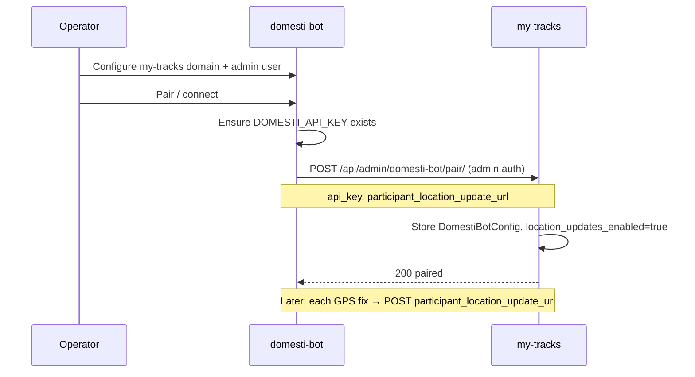

# Plan: domesti-bot location relay (my-tracks companion)

This document is the **my-tracks** side of integrating with [domesti-bot](https://github.com/the-hcma/domesti-bot). domesti-bot owns home automation rules, geofence evaluation, sunset checks, and device actions. my-tracks remains the **location ingest and map** service and relays GPS fixes to domesti-bot when paired.

**Status:** planning only — no relay or admin UI implemented in this document.

---

## Responsibilities split

| Concern | Owner | Mechanism |
| --- | --- | --- |
| OwnTracks ingest, map, friends | my-tracks | Existing MQTT/HTTP → SQLite |
| Participant roster | my-tracks (source of truth) | **Manual pull** by domesti-bot (`POST /v1/rules/participants/sync`) |
| Geofence definitions (automation) | domesti-bot | **Manual pull** by domesti-bot (`POST /v1/rules/geofences/sync`) from my-tracks export APIs |
| Live GPS fixes for rules | my-tracks → domesti-bot | **Automatic push** on each saved location (`POST` to domesti-bot participant location update URL) |
| Rule evaluation & device actions | domesti-bot | `RuleEvaluator` (not my-tracks) |

We do **not** extend `GlobalAutomationRule` webhooks. Event-shaped payloads (“both inside”) are insufficient; domesti-bot needs per-fix coordinates.

---

## What stays manual (no my-tracks push webhooks)

### Participants

- domesti-bot operator clicks **Sync from my-tracks** (or runs sync during setup).
- domesti-bot calls my-tracks with admin credentials and reads:
  - `GET /api/admin/users-with-devices/` (already exists)
- my-tracks does **not** POST roster updates to domesti-bot on user/device changes or startup.

### Geofences

- domesti-bot operator runs geofence sync manually.
- domesti-bot reads:
  - `GET /api/admin/waypoints/` (already exists)
- my-tracks does **not** push geofence definitions to domesti-bot.

---

## What is automatic (participant location relay only)

After pairing (below), and when **location update webhooks are enabled** (`location_updates_enabled`), my-tracks POSTs **every saved location** for devices with an `owner` to the configured `participant_location_update_url`. Each attempt is recorded in a **last-five delivery log** (see Admin Panel).

**Hook points** (both ingest paths):

- `save_location_to_db` (MQTT) — after `Location` row is created
- `LocationViewSet.create` (HTTP OwnTracks POST) — after `perform_create`

**Payload** (per fix):

```json
{
  "participant_id": "kristen",
  "lat": 41.194085,
  "lon": -73.888365,
  "accuracy_m": 12,
  "timestamp": "2026-06-09T23:14:58Z",
  "source": "my-tracks",
  "device_id": "pixel7pro",
  "mqtt_user": "kristen"
}
```

| Field | Source |
| --- | --- |
| `participant_id` | `device.owner.username` |
| `lat` / `lon` | `Location.latitude` / `Location.longitude` |
| `accuracy_m` | `Location.accuracy` (omit when null) |
| `timestamp` | `Location.timestamp` ISO-8601 UTC |
| `device_id` / `mqtt_user` | debug only on domesti-bot side |

**Transport:** `urllib` POST, 5 s timeout, header `X-Domesti-Api-Key: <stored key>`. Failures are **logged and swallowed** — domesti-bot downtime must never block location ingest. Every send (live or test) appends one row to the ring buffer; only the **five most recent** entries are kept.

**Gating:** skip relay when not paired, when `location_updates_enabled` is `false`, or when `participant_location_update_url` / `api_key` is missing.

**Identity:** relay is per **device owner**, not per map viewer. Friends who see shared devices on the map do not change relay identity.

**domesti-bot route:** the default prepopulated URL targets domesti-bot’s existing ingest endpoint `POST /v1/webhooks/presence`. my-tracks names the setting by what it does (participant location updates), not domesti-bot’s internal route name.

---

## Admin Panel configuration (not env-only)

Store settings in a **singleton** model (same pattern as `SmtpConfig`): `DomestiBotConfig` with `pk=1`.

Admin Panel gains a **domesti-bot** section (staff only). The section header links to the [domesti-bot repository](https://github.com/the-hcma/domesti-bot) for setup docs.

**Pairing state drives the UI.** `is_paired` is derived from `paired_at` and a configured `api_key` (both set by the pairing endpoint). Until paired, config fields are **read-only and visually grayed out**; after pairing they become editable (except the API key, which stays masked).

| Field | Purpose | Set by | Used for |
| --- | --- | --- | --- |
| `domesti_base_url` | domesti-bot HTTP origin (reference + URL building) | pairing (optional) | display / validation |
| `participant_location_update_url` | Where my-tracks POSTs each participant location fix | pairing | **automatic relay** |
| `api_key` | Shared secret for outbound `X-Domesti-Api-Key` | pairing | automatic relay |
| `paired_at` | Last successful pair timestamp | pairing | **pairing status** |
| `location_updates_enabled` | Send location update webhooks to domesti-bot | pairing (`true` on success); operator toggles in Admin Panel | **automatic relay on/off** |

`api_key` is **encrypted at rest** (Fernet / `SECRET_KEY`, same approach as `SmtpConfig.encrypted_password`). Admin UI shows “configured” with a masked value (`••••••••`); it is never displayed in full and is not typed by hand in my-tracks.

**Prepopulation on pair** (domesti-bot supplies values; my-tracks does not require manual entry):

- `participant_location_update_url` — domesti-bot sends its public ingest URL (typically `{domesti_base_url}/v1/webhooks/presence`).
- `domesti_base_url` — optional; when omitted, derived from the location update URL origin.
- Host hints when domesti-bot builds defaults: `PUBLIC_DOMAIN` on my-tracks, or request host; port `8003` matches domesti-bot’s default LAN listen port.

Operators may override URL fields **after** pairing; re-pairing from domesti-bot refreshes key and URLs.

### Recent webhook log (last 5)

Persist delivery history for operator visibility. Store as a **ring buffer of five entries** (newest first), either a `JSONField` on `DomestiBotConfig` or a small `DomestiBotWebhookDelivery` table pruned on insert — implementation choice in P3; behavior is the same.

Each entry:

| Field | Notes |
| --- | --- |
| `sent_at` | UTC timestamp |
| `success` | `true` if HTTP 2xx |
| `http_status` | Response status code, or `null` on connection error |
| `participant_id` | From payload |
| `payload` | Full JSON body sent (or truncated in API if oversized) |
| `response_preview` | First ~200 chars of response body, or error string |
| `source` | `live` (real GPS relay) or `test` (manual test button) |
| `elapsed_ms` | Round-trip time |

Included in Admin Panel status and in `GET /api/admin/domesti-bot/config/` for staff (newest first, max 5).

---

## Pairing flow (domesti-bot → my-tracks)

API key delivery is **not** typed by hand in my-tracks. **domesti-bot initiates pairing** during setup: it calls my-tracks and relays the shared secret plus the participant location update URL my-tracks should use.



### my-tracks pairing endpoint (to implement)

```
POST /api/admin/domesti-bot/pair/
Content-Type: application/json
```

**Authentication:** domesti-bot uses the same **admin session** flow as export sync today (login + session cookie + CSRF), or an admin API token if we add one later. Only staff may pair.

**Request body:**

```json
{
  "api_key": "<domesti-bot DOMESTI_API_KEY>",
  "participant_location_update_url": "http://192.168.1.10:8003/v1/webhooks/presence",
  "domesti_base_url": "http://192.168.1.10:8003"
}
```

| Field | Required | Notes |
| --- | --- | --- |
| `api_key` | yes | Stored encrypted; used on every location relay |
| `participant_location_update_url` | yes | Must be absolute HTTP(S) URL |
| `domesti_base_url` | no | Updates reference field; defaults derived if omitted |

**Responses:**

- `200` — config saved, `location_updates_enabled=true`, `paired_at` set
- `400` — validation error (bad URL, missing key)
- `403` — not staff

**Response body (example):**

```json
{
  "paired_at": "2026-06-09T23:00:00Z",
  "participant_location_update_url": "http://192.168.1.10:8003/v1/webhooks/presence",
  "location_updates_enabled": true,
  "api_key_configured": true
}
```

(API key is never returned after save.)

### domesti-bot companion ([the-hcma/domesti-bot](https://github.com/the-hcma/domesti-bot))

When the operator completes **My Tracks** settings in domesti-bot and clicks **Pair**, domesti-bot:

1. Reads its own `DOMESTI_API_KEY` and public base URL.
2. Authenticates to my-tracks as the configured admin user.
3. Calls `POST /api/admin/domesti-bot/pair/` with `api_key` and `participant_location_update_url`.
4. Optionally runs **participants** and **geofences** sync immediately (manual pull — unchanged).

No my-tracks code pushes the API key to domesti-bot; direction is **domesti-bot → my-tracks** only.

---

## Admin Panel UX (to implement)

**Section: domesti-bot integration**

Link in section header: [github.com/the-hcma/domesti-bot](https://github.com/the-hcma/domesti-bot).

### Not paired

- **Status badge:** “Not paired” (prominent).
- **All config fields grayed out** (`disabled` inputs): base URL, participant location update URL, API key indicator, location-updates toggle, recent webhook log (empty or hidden).
- **Help text:** Pair from domesti-bot (My Tracks settings → Pair). Participants and geofences are synced **from domesti-bot** after pairing, not pushed from my-tracks.
- No test button (nothing to send yet).

### Paired

- **Status badge:** “Paired” with `paired_at` timestamp.
- **Fields enabled:** base URL and participant location update URL editable; API key shows “configured” (masked).
- **Location updates toggle:** labeled e.g. **“Send location updates to domesti-bot”** — maps to `location_updates_enabled`. On when pairing succeeds; operator can disable without unpairing (pauses live webhook POSTs; test button still works).
- **Recent webhook log:** table of the **last 5** deliveries (newest first). Each row shows: time, success/failure badge, `participant_id`, HTTP status, truncated payload JSON, response preview or error. Includes both `live` and `test` sends. Empty state: “No location updates sent yet.”
- **Re-pair hint:** “To rotate the API key or change URLs, use Pair in domesti-bot.”

**Save toggle** via Admin Panel form post or:

```
PATCH /api/admin/domesti-bot/config/
Content-Type: application/json
```

```json
{ "location_updates_enabled": false }
```

Staff only; `403` when not paired. Other config fields may use the same endpoint when editable.

### Test location update (manual verification)

Available **only when paired** (staff). Lets the operator confirm my-tracks can reach domesti-bot before relying on live GPS relay.

**UI:** “Test location update” button opens a small panel (or inline result):

- Optional `participant_id` (dropdown of usernames with devices, default first admin/test user).
- Sends one **synthetic** location payload to `participant_location_update_url` using the stored `api_key` (same shape as production relay).
- Shows result inline: HTTP status, response time, truncated response body, or error message.

**Backend (to implement):**

```
POST /api/admin/domesti-bot/test-location-update/
Content-Type: application/json
```

```json
{
  "participant_id": "kristen",
  "lat": 41.194085,
  "lon": -73.888365
}
```

| Field | Required | Notes |
| --- | --- | --- |
| `participant_id` | no | Defaults to a sensible staff username; must exist in my-tracks |
| `lat` / `lon` | no | Defaults to fixed test coordinates if omitted |

- `403` when not paired or not staff.
- `200` with `{ "ok": true, "status_code": 200, "elapsed_ms": 42, "response_preview": "..." }` on success.
- `502` / `200` with `ok: false` when domesti-bot is unreachable or returns an error (operator sees details; no Location row is written).

Test sends are appended to the **recent webhook log** with `source: "test"`. The log updates immediately in the UI after test or live delivery.

This is **test mode only** — it does not enqueue real device locations and does not affect the map.

Do **not** add env vars as the primary configuration path. A `DOMESTI_BOT_PARTICIPANT_LOCATION_UPDATE_URL` bootstrap override may exist for headless deploys, but Admin Panel is the operator source of truth.

---

## End-to-end flow (after implementation)

1. Operator pairs domesti-bot → my-tracks (API key + participant location update URL stored).
2. Operator runs **participant sync** and **geofence sync** manually in domesti-bot.
3. Operator creates rules in domesti-bot (e.g. both inside + after sunset → lights + garage).
4. Phone → MQTT → my-tracks saves location → (if `location_updates_enabled`) POST participant location update URL → domesti-bot evaluator runs; attempt appears in last-five log.
5. Global automations in my-tracks may still run in parallel until a later **sunset** PR removes them.

---

## Implementation PR stack (my-tracks, future)

| PR | Scope |
| --- | --- |
| **This PR** | `docs/DOMESTI_BOT_INTEGRATION_PLAN.md` only |
| **P1** | `DomestiBotConfig` model + migration; Admin Panel form; `GET` status for staff |
| **P2** | `POST /api/admin/domesti-bot/pair/`; encrypt/store API key; pairing-gated Admin UI |
| **P3** | `app/domesti_relay.py` + hooks in MQTT + HTTP location save; respect `location_updates_enabled`; last-five webhook log |
| **P4** | `POST /api/admin/domesti-bot/test-location-update/`; tests; link from `GLOBAL_AUTOMATIONS_PLAN.md` |
| **P5** (later) | Remove `GlobalAutomationRule` evaluator after domesti-bot cutover |

**domesti-bot companion** ([repo](https://github.com/the-hcma/domesti-bot)): pairing button + `POST` to my-tracks pair endpoint; keep manual participant/geofence sync as today.

---

## Testing strategy

| Layer | Coverage |
| --- | --- |
| Pair endpoint | Staff auth; stores encrypted key; enables relay; rejects bad URLs |
| Relay | Mock HTTP; MQTT + HTTP ingest; skip when unpaired or toggle off; failure does not fail save |
| Webhook log | Ring buffer keeps 5; success/failure; live + test; payload stored |
| Admin UI | Pairing badge; toggle; last-five log table; fields disabled when not paired; masked key when paired |
| Test location update | Staff-only; synthetic POST; clear success/failure feedback; appears in webhook log |
| Integration | Optional manual test with LAN domesti-bot instance |

---

## Success criteria

1. Before pairing, Admin Panel shows “Not paired” with grayed-out fields; after pairing, status and URLs are visible and editable.
2. Operator can run **Test location update** and see a successful response from domesti-bot.
3. Operator can disable **Send location updates** without unpairing; live POSTs stop while test remains available.
4. Admin Panel shows the **last 5** webhook attempts with payload and success/failure status.
5. Each owned-device GPS fix triggers a location POST when location updates are enabled.
6. domesti-bot `/v1/rules/status` shows live participant fixes after manual roster sync.
7. Participant and geofence data flow only via **manual** domesti-bot sync pulls.
8. Relay failures appear in logs and webhook log; map and ingest unaffected.

---

## References

- domesti-bot: [github.com/the-hcma/domesti-bot](https://github.com/the-hcma/domesti-bot) — see `docs/RULE_ENGINE_PLAN.md` in that repo (evaluator, webhooks, manual sync)
- my-tracks exports: `app/admin_sync_export.py` (`/api/admin/users-with-devices/`, `/api/admin/waypoints/`)
- my-tracks global automations (to sunset): `docs/GLOBAL_AUTOMATIONS_PLAN.md`
